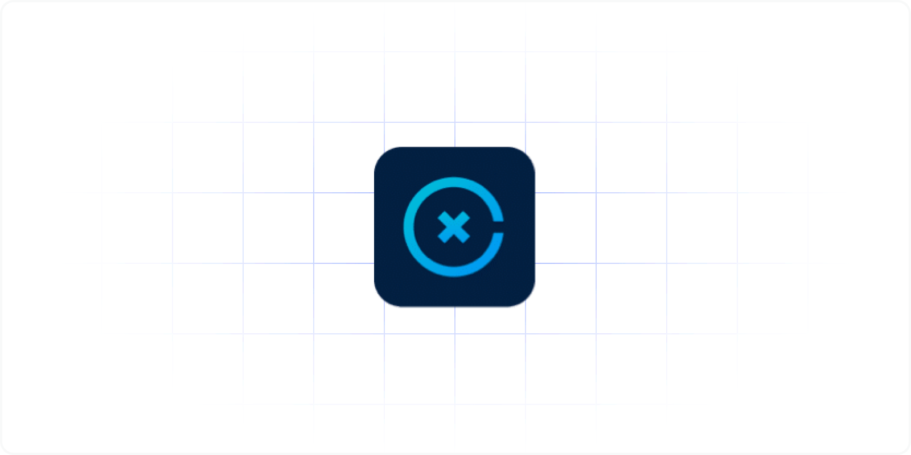

# XS2A Core: A reference Java implementation of NextGenPSD2 XS2A Interface of Berlin Group

This is adorsys XS2A Core: a fully PSD2 compliant XS2A interface, supporting every mandatory and the majority of optional PSD2 XS2A flows. It can be connected to any banking middleware or core banking system.
XS2A Core is the only open source (AGPL v.3) implementation of the NextGenPSD2 initiative fully supporting Berlin Group's specification for XS2A Interoperability Framework and its APIs. It is also the most secure solution in the market.
The software in this repository is for try-out only. It is delivered as-is and comes without any warranty, to the extent permitted by applicable law.

**Caveat:** This repository is not the latest version of XS2A Core as it runs with our enterprise clients. Do not use it in production environments! This public repository will only be updated every 6 months or so. It may contain security related issues that are already fixed with our customers but did not make it to the public repository, yet.

**Enterprise Version:** There is an enterprise version of XS2A Core that we proudly manage, adapt, extend, improve and operate for our enterprise clients, mostly European banks and open banking aggregators.

**Partnerships:** If you are an organization that would like to commercially use our solutions beyond AGPL v3 requirements, please get in contact. We already have partners that use XS2A Core as a foundation for their own offerings.

**Upcoming Regulation:** If you are interested in this project's further developments in the context of Berlin Group, Open Banking UK, PSD3, PSR, DORA and FIDA, please get in contact.

For any inquiries please write to [sales@adorsys.com](mailto://sales@adorsys.com).

## Some Background

With **PSD2** Directive (EU) 2015/2366 the European Union has forced the Banking Market to open the Banking Services to Third Party Service Providers (TPP), given they act on behalf of the *Payment Service User*s (PSU).

The **Berlin Group** is a pan-European payments interoperability standards and harmonization initiative. Based on the PSD2 and EBA RTS requirements, Berlin Group NextGenPSD2 has worked on a detailed ['Access to Account  (XS2A) Framework'](https://www.berlin-group.org/psd2-access-to-bank-accounts) with a data model (at conceptual, logical and physical data levels) and associated messaging.

We at **[adorsys](https://adorsys.com/)** are IT and information architects. We build, secure and operate platforms for our customers in highly regulates industries, in particular finance for more than 15 years now. We are experts for open finance and have been active in this domain from the very beginning.

### Quick facts about this XS2A Service

* Currently supported latest version of NextGenPSD2 XS2A Implementation Guidelines **1.3.11** and OpenAPI .yaml file **1.3.11_2021-09-24**.  
  You can check out our [Swagger API yaml file](xs2a-impl/src/main/resources/static/psd2-api_v1.3.11-2021-10-01v1.yaml).
* All mandatory API endpoints defined in Berlin Group specification are IMPLEMENTED.
* Comes with pluggable **Consent Management System** to store and manage consents given by PSU to corresponding TPPs.
* **ASPSP-Profile** module allows you to configure ASPSP-specific configuration for XS2A-features, for example used SCA approaches, payment products, consent types etc.
* Proven [NISP](https://nisp.online)-compliant implementation.

## Project documentation

[Documentation](doc/index.adoc) provides actual automatically build documentation, such as:
* Architecture documentation
* Use-cases diagrams
* Developer guides
* Release policy
* Roadmap
* Release notes

### Getting Started

* For try-out version you can build the sources on your local machines. To do so, download or checkout the definite branch (branch name is actually a release name) and build it.
* If you want to play with the framework in isolated environment, check out [Modelbank](https://github.com/adorsys/XS2A-Sandbox) Repository.
* To know how to write a connector to your banking system see our [XS2A Connector Examples](https://github.com/adorsys/xs2a-connector-examples) repository and [SPI Developer Guide](<doc/SPI Developer Guide/SPI_Developer_Guide.adoc>)
* [These instructions](doc/GETTING_STARTED.adoc) will help you to get a copy of the project up and running on your local machine for development and testing purposes.

## Development and contributing

Please read [CONTRIBUTING](doc/CONTRIBUTING.md) for details on our code of conduct, and the process for submitting pull requests to us.
The list of contributors can be found [here](doc/contributors.md).

## Contact

For commercial support please contact [sales@adorsys.com](mailto://sales@adorsys.com).

## License

This project is licensed under Affero GNU General Public License v.3 (AGPL v.3). See the [LICENSE](LICENSE) file for details. For alternative individual licensing options please contact us at [sales@adorsys.com](mailto://sales@adorsys.com).

