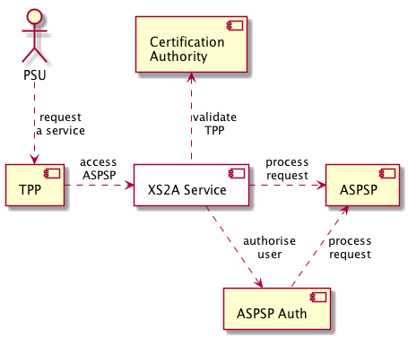

[<--- Back to table of contents](README.md)

System Scope and Context
========================

Business Context
----------------

| System                  | Description                                                                                                                                |
|-------------------------|--------------------------------------------------------------------------------------------------------------------------------------------|
| XS2A Service            | The service, implementing XS2A interface of Berlin Group and corresponding BL, including Consent Management.                               |
| TPP                     | Third-party provider, acting on behalf of PSU, operating the accounts/payment data of PSU provided by ASPSP through XS2A Interface.        |
| ASPSP                   | Account Servicing Payment Service Provider, normally a banking system that controls accounts of PSU and performs "classic" banking on it.  |
| ASPSP-Auth              | ASPSP Authentification/Authorisation system. Performs a Strong Customer Authorisation using the security mechanisms of concrete ASPSP.     |
| Certification Authority | External QWAC Certificate provider for TPPs. Defined by local government authority for each EU country.                                    |

[//]: # (**&lt;optionally: Explanation of external domain interfaces&gt;**)

[//]: # (Technical Context)
[//]: # (-----------------)

[//]: # (**&lt;Diagram or Table&gt;**)

[//]: # (**&lt;optionally: Explanation of technical interfaces&gt;**)

[//]: # (**&lt;Mapping Input/Output to Channels&gt;**)

[<--- Back to table of contents](README.md)
