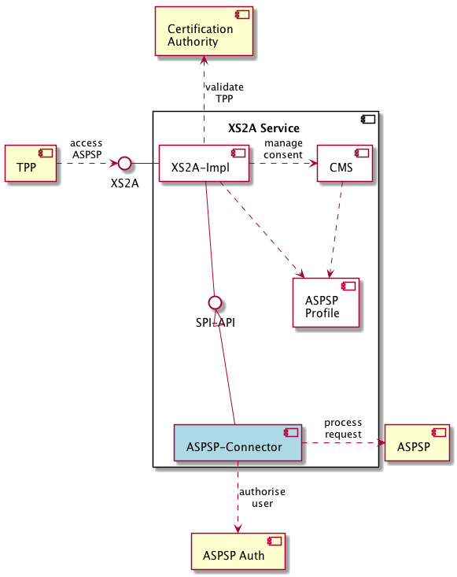

[<--- Back to table of contents](README.md)

Building Block View
===================

Whitebox Overall System
-----------------------

***\<Overview Diagram\>***

Motivation

:   *\<text explanation\>*

Contained Building Blocks

| Component                                          | Description                                                                                                                                |
|----------------------------------------------------|--------------------------------------------------------------------------------------------------------------------------------------------|
| [XS2A-Impl](../../xs2a-impl/README.md)             | an external interface and corresponding validators and services operating to serve TPPs according to a Berlin Group operational rules      |
| [CMS](../../consent-management-system/README.md)   | Third-party provider, acting on behalf of PSU, operating the accounts/payment data of PSU provided by ASPSP through XS2A Interface.        |
| [ASPSP Profile](../../aspsp-profile/README.md)     | a service that provides static configuration of features, those are supported by actual ASPSP                                              |
| [SPI-API](../../spi-api/README.md)                 | internal Java interface to provide a universal way to implement connectors to underlying ASPSP Systems                                     |
| ASPSP-Connector                                    | an implementation of spi-api interface to connect XS2A-services with ASPSP internal system to process requests                             |

Important Interfaces

:   *\<Description of important interfaces\>*

### \<Name black box 1\> {#_name_black_box_1}

*\<Purpose/Responsibility\>*

*\<Interface(s)\>*

*\<(Optional) Quality/Performance Characteristics\>*

*\<(Optional) Directory/File Location\>*

*\<(Optional) Fulfilled Requirements\>*

*\<(optional) Open Issues/Problems/Risks\>*

### \<Name black box 2\> {#_name_black_box_2}

*\<black box template\>*

### \<Name black box n\> {#_name_black_box_n}

*\<black box template\>*

### \<Name interface 1\> {#_name_interface_1}

...​

### \<Name interface m\> {#_name_interface_m}

Level 2 {#_level_2}
-------

### White Box *\<building block 1\>* {#_white_box_building_block_1}

*\<white box template\>*

### White Box *\<building block 2\>* {#_white_box_building_block_2}

*\<white box template\>*

...​

### White Box *\<building block m\>* {#_white_box_building_block_m}

*\<white box template\>*

Level 3 {#_level_3}
-------

### White Box \<\_building block x.1\_\> {#_white_box_building_block_x_1}

*\<white box template\>*

### White Box \<\_building block x.2\_\> {#_white_box_building_block_x_2}

*\<white box template\>*

### White Box \<\_building block y.1\_\> {#_white_box_building_block_y_1}

*\<white box template\>*

[<--- Back to table of contents](README.md)
