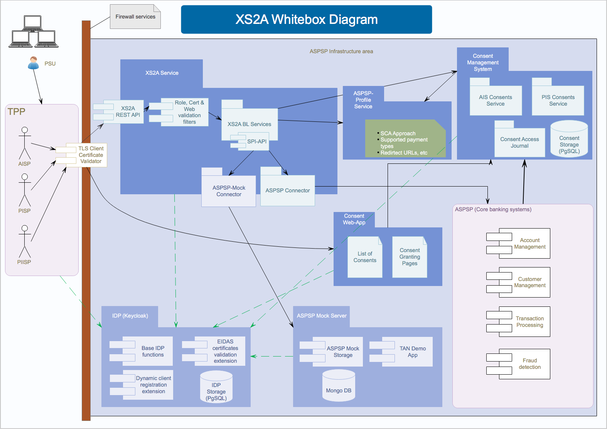

# Architecture documentation

* [About arc42](about-arc42.md)
* [**1. Requirements and Goals**](01_introduction_and_goals.md)
* [**2. Constraints**](02_architecture_constraints.md)
* [**3. Scope & Context**](03_system_scope_and_context.md)
* [**4. Solution Strategy**](04_solution_strategy.md)
* [**5. Building Block View**](05_building_block_view.md)
* [**6. Runtime View**](06_runtime_view.md)
* [**7. Deployment View**](07_deployment_view.md)
* [**8. Crosscutting Concepts**](08_concepts.md)
* [**9. Architecture Decisions**](09_design_decisions.md)
* [**10. Quality Scenarios**](10_quality_scenarios.md)
* [**11. Risks & Technical Debt**](11_technical_risks.md)
* [**12. Glossary**](12_glossary.md)

Old Building Block View
===================

### Components description

#### TLS Client Certificate Validator
According to the operational rules, connections between TPP and ASPSP must be secured by TLS/HTTPS connection with a 
client certificate. This component should provide the possibility to end SSL-Connection at the first edge before the 
XS2A Service itself.
While this functionality is typical for such firewall services, this module is not included into this project. However 
the client certificate might be required to be included into a HTTP header for following processing on XS2A endpoints.

#### XS2A-Service
The major component that utilizes XS2A-compliant requests to ASPSP, performing their processing according to operational
rules specified by Berlin Group. Based on the features supported by the ASPSP and configured by the ASPSP profile 
perfoms all necessary operations to process TPP request, including its technical and business validation, logging and 
serving corresponding redirect links in case of need.
Includes ASPSP-specific implementation of SPI-API interface to communicate processing orders to ASPSP systems.
 
Technically utilizes connections to ASPSP systems, as well as to ASPSP Profile and Consent Management System.

#### ASPSP-Profile
ASPSP-Profile serves a configuration of XS2A features and options supported by the actual ASPSP to other components. 
Normally this configuration is highly dependend from the core banking systems, therefore is not changed very often.
A list of supported features should be provided by a developers guide of ASPSP.

#### Consent Web-App
Provides end-user interface to perform operations on the user's consents, including granting a consents, listing given 
consents with their status and attributes and revoking consents. Due to high coupling with the other banking systems 
this application is to be developed by every ASPSP itself.

#### Consent Management System
Stores and manages (granting, listening, using and revoking) various consents granted by the PSU to TPP to access 
resources owned by PSU at the ASPSP. Normally this includes also logging access and usage of consents. 
Provides a relational DB storage connector.

#### ASPSP (Core banking systems)
References to core banking systems responsible for processing payments, accounts management and other typical banking 
processes. In XS2A Service ASPSP acts as an end-actor, who is reponsible to do the end-job with user data, based on TPP 
request and consents given TPP by PSU.

