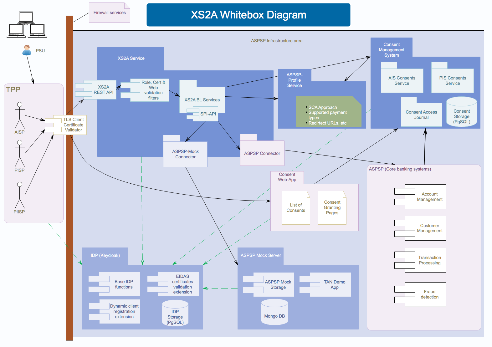

# Architecture documentation

This implementation provides a REST-interface and corresponding services, that could be operated as a proxy to 
underlying ASPSP-Systems,
providing capabilities to interoperate with TPP by defined XS2A Standard Interface of Berlin Group.

### Brief modules description
The maven modules provided by this implementation are:
* [**aspsp-idp**](../../aspsp-idp/README.md) - provides identity provider for the service based on 
[Keycloak](https://www.keycloak.org/) with extension for OpenID dynamic client registration
* [**aspsp-mock-server**](../../aspsp-mock-server/README.md) - a mock-implementation of ASPSP for the purposes of 
testing and introspecting of xs2a-functionality. Provides also a demo TAN application to grant XS2A consents by end-user 
(PSU)
* [**aspsp-profile**](../../aspsp-profile/README.md) - a service that provides static configuration of features, those 
are supported by actual ASPSP 
* **consent-api** - API Domain objects for intercommunication with Consent Management System
* [**consent-management-system**](../../consent-management-system/README.md) - a service that stores and manages 
consents given by the end user
* **psd2-validator** - a reusable component to verify client certificate and signature according to PSD2 requirements
* **spi-api** - internal Java interface to provide a universal way to implement connectors to underlying ASPSP Systems
* **spi-mock** - an implementation of spi-api interface to connect XS2A-services with ASPSP-Mock-Server
* [**xs2a-impl**](../../xs2a-impl/README.md) - a REST-interface and corresponding validators and services operating to 
serve TPPs according to a Berlin Group operational rules

### Components description

#### TLS Client Certificate Validator
According to the operational rules, connections between TPP and ASPSP must be secured by TLS/HTTPS connection with a 
client certificate. This component should provide the possibility to end SSL-Connection at the first edge before the 
XS2A Service itself.
While this functionality is typical for such firewall services, this module is not included into this project. However 
the client certificate might be required to be included into a HTTP header for following processing on XS2A endpoints.

#### XS2A-Service
The major component that utilizes XS2A-compliant requests to ASPSP, performing their processing according to operational
rules specified by Berlin Group. Based on the features supported by the ASPSP and configured by the ASPSP profile 
perfoms all necessary operations to process TPP request, including its technical and business validation, logging and 
serving corresponding redirect links in case of need.
Includes ASPSP-specific implementation of SPI-API interface to communicate processing orders to ASPSP systems.
 
Technically utilizes connections to ASPSP systems, as well as to ASPSP Profile and Consent Management System.

#### Identity provider (IDP)
A keycloak based implementation of OAuth2/OpenID Server that may be used as a ready solution to provide authentication 
to the other components. Depending on the SCA aproach choosen by the ASPSP configuration is used to authorize all 
connections between services or only access to the data in the mock-implementation.

#### ASPSP-Profile
ASPSP-Profile serves a configuration of XS2A features and options supported by the actual ASPSP to other components. 
Normally this configuration is highly dependend from the core banking systems, therefore is not changed very often.
A list of supported features should be provided by a developers guide of ASPSP.

#### Consent Web-App
Provides end-user interface to perform operations on the user's consents, including granting a consents, listing given 
consents with their status and attributes and revoking consents. Due to high coupling with the other banking systems 
this application is to be developed by every ASPSP itself.

#### Consent Management System
Stores and manages (granting, listening, using and revoking) various consents granted by the PSU to TPP to access 
resources owned by PSU at the ASPSP. Normally this includes also logging access and usage of consents. 
Provides a relational DB storage connector.

#### ASPSP (Core banking systems)
References to core banking systems responsible for processing payments, accounts management and other typical banking 
processes. In XS2A Service ASPSP acts as an end-actor, who is reponsible to do the end-job with user data, based on TPP 
request and consents given TPP by PSU.

