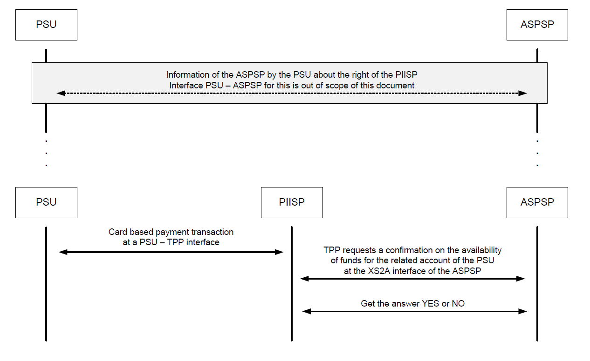

# XS2A interface –> Core services-> Confirmation of Funds Service

## FCS_01 Confirmation of Funds Service (FCS).
This service may be used by a PIISP to request a confirmation
of the availability of specific funds on the account of a PSU. The
account is managed by the ASPSP providing the XS2A
Interface.

## Confirmation of Funds Service Flows
The TPP can use transactions according to this use case to receive confirmation about the
availability of the requested funds on a specific account. As a result the TPP will only receive
the answer **YES** or **NO**. No further information about the account will be returned.

While the transaction at the XS2A interface is initiated by the TPP, it must first be initiated by
the PSU by means of a card based payment transaction at a PSU – TPP interface, for example
at a checkout point.

PSU has to inform the ASPSP about its consent to a
specific request of the TPP prior to the transaction.

The ASPSP will reject the transaction if the TPP cannot be identified correctly at the XS2A
interface and/or if it does not have the role PIISP.

The ASPSP will also reject the transaction if the PSU has not previously informed the ASPSP
about its consent to the corresponding transaction of the TPP.

The following figure shows only the very top level information flow:

### Data Overview Confirmation of Funds Service

The following table defines the technical description of the abstract data model for the three PSD2 services. The columns give an overview on the API protocols
as follows:
* The **"Data element"** column is using the abstract data elements  to deliver the connection to rules and role definitions.
* The **"Attribute encoding"** is giving the actual encoding definition within the XS2A
API.
* The **"Location"** columns (Path, Header, Body) define, where the corresponding data elements are
transported as https parameters, resp. are taken from e-Idas certificates.
* The **"Usage"**  column (Conf. Req., Conf Resp.) gives an overview on the usage of data elements in the
different services and API Calls. The XS2A calls are described
as abstract API calls. These calls will be technically realised as HTTPS POST
command. The calls are divided into the following calls:
    * Confirmation Request, which is the only API Call for every transaction
within the Confirmation of Funds service.

The following usage of abbreviations in the Location and Usage columns is defined:
* x: This data element is transported on the corresponding level.
* m: Mandatory
* o : Optional for the TPP to use
* c: Conditional. The Condition is described in the API Calls, condition defined by
  the ASPSP

| Data element               | Attribute encoding | Path | Header | Body | Certificate | Conf.  Req. | Conf.  Resp. |
|----------------------------|--------------------|:----:|:------:|:----:|:-----------:|:-----------:|:------------:|
|  Provider Identification   |                    |   x  |        |      |             |      m      |              |
| TPP Registration Number    |                    |      |        |      |      x      |      m      |              |
| TPP Name                   |                    |      |        |      |      x      |      m      |              |
| TPP Roles                  |                    |      |        |      |      x      |      m      |              |
| Transaction Identification | TPP- Transaction-ID|      |        |   x  |             |             |              |
| Request Identification     | x-request-id     |      |        |      |             |             |              |
| TPP Certificate Data       | TPP-Certificate    |      |    x   |      |             |      c      |              |
| TPP Electronic Signature   | Signature          |      |    x   |      |             |      c      |              |
| Service Type               |                    |   x  |        |      |             |      m      |              |
| Response Code              |                    |      |    x   |      |             |             |       m      |
| TPP Message Information    | tppMessages        |      |        |   x  |             |             |       o      |
| Card Number                | cardNumber         |      |        |   x  |             |      c      |              |
| Account Number             | psuAccount         |      |        |   x  |             |      m      |              |
| Name Payee                 | payee              |      |        |   x  |             |      o      |              |
| Transaction Amount         | instructedAmount   |      |        |   x  |             |      m      |              |

### Confirmation of Funds Request
#### FCS_01_01 Confirmation of Funds Request

##### Call
    POST /v1/funds-confirmations
Creates a confirmation of funds request at the ASPSP.

##### Path
    No specific path parameters.
    
##### Query Parameter
No specific query parameter.

##### Request Header

| Attribute            | Type     | Condition   | Description                                                                                |
|----------------------|----------|-------------|--------------------------------------------------------------------------------------------|
| TPP-Transaction-ID   | UUID     | Mandatory   | ID of the transaction as determined by the initiating party.                               |
| x-request-id       | UUID     | Mandatory   | ID of the request, unique to the call, asdetermined by theinitiating party.                |
| Authorization Bearer | String   | Conditional | Is contained only, if the optional Oauth Pre-Step was performed.                           |
| Signature            | String   | Conditional | A signature of the request by the TPP onapplication level. This might be mandated byASPSP. |
| TPP-Certificate      | String   | Conditional | The certificate used for signing the request in base64 encoding.                                              |

##### Request Body

| Attribute         | Type              | Condition   | Description                                                                  |
|-------------------|-------------------|-------------|------------------------------------------------------------------------------|
| cardNumber        | String            | Conditional | Card Number of the card issued by the PIISP. Must be delivered if available. |
| psuAccount        | Account Reference | Mandatory   | PSU’s account number.                                                        |
| payee             | String            | Optional    | The merchant where the card is acceptedas an information to the PSU.         |
| instructedAmount  | Amount            | Mandatory   | Transaction amount to be checked withinthe funds check mechanism.            |

##### Response Body

| Attribute         | Type              | Condition   | Description                                                                  |
|-------------------|-------------------|-------------|------------------------------------------------------------------------------|
| fundsAvailable    | Boolean           | Mandatory   | Equals “true” if sufficient funds are available at the time of the request, “false” otherwise. |

The following rules will apply in interpreting the Confirmation of Funds Request for multicurrency accounts:
* The additional card number might support the choice of the sub-account.
* If no card number, but the PSU account identifier is contained: check on default account registered by customer.
* If no card number but the PSU and the account identifier with currency is contained: check the availability of funds on the corresponding sub-account.
* If card number and the PSU account identifier is contained:: check on sub-account addressed by card, if the addressed card is registered with one of the sub-accounts.
* If the card number is not registered for any of the accounts, the card number is ignored.

##### Example

    POST https://api.testbank.com/v1/payments/sepa-credit-transfers 
    Content-Encoding:	gzip
    Content-Type:	application/json
    TPP-Transaction-ID: 3dc3d5b3-7023-4848-9853-f5400a64e879 
    x-request-id: 99391c7e-ad88-49ec-a2ad-99ddcb1f7721 
    Date:	Sun, 06 Aug 2017 15:02:37 GMT
    {	
     "cardNumber": "12345678901234", 
     "psuAccount":{"iban":"DE23100120020123456789"},
     "instructedAmount": {"currency" : "EUR" , "content" : "123"}
    }

*Response Body

    {"fundsAvailable":"true"}

