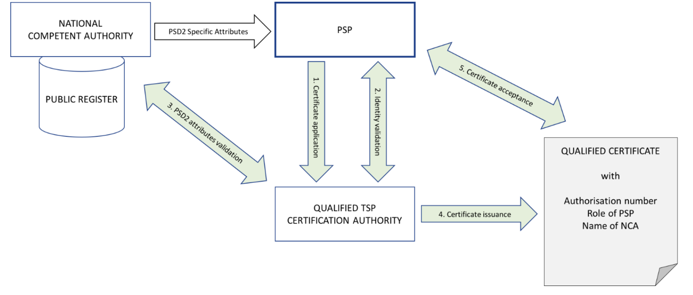
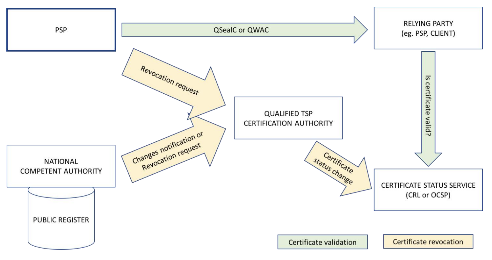

# Usage of qualified certificates

This specification defines a standard for implementing the requirements of the RTS for use of qualified
                   certificates as defined in eIDAS to meet the regulatory requirements of PSD2.

Before the issuance process can start, the PSP needs to be registered by NCA and all relevant information needs to be
available in public registry:
1) PSP submits the certificate application and provides all necessary documentation containing PSD2 specific
attributes to the Trust Service Provider (TSP) with granted qualified status.
2) TSP performs identity validation as required by its certificate policy.
3) TSP validates PSD2 specific attributes using information provided the NCA (e.g. public registry, authenticated
letter).
4) TSP issues the qualified certificate in compliance with the profile requirements given in the present document.
5) PSP accepts the certificate. 

##  General concepts

For the purpose of identification, payment service providers rely on qualified
certificates for electronic seals or qualified certificates for website authentication.
A website authentication certificate makes it possible to establish a Transport Layer Security (TLS) channel with the
subject of the certificate, which guarantees confidentiality, integrity and authenticity of all data transferred through the
channel.
A certificate for electronic seals allows the relying party to validate the identity of the subject of the certificate, as well
as the authenticity and integrity of the sealed data, and also prove it to third parties. The electronic seal provides strong
evidence, capable of having legal effect, that given data is originated by the legal entity identified in the certificate.

## Roles

* account servicing (PSP_AS);
* payment initiation (PSP_PI);
* account information (PSP_AI); 
* issuing of card-based payment instruments (PSP_IC)

## Payment Service Provider Authorizations and Services Passporting

According to PSD2 and Credit Institutions Directive, the competent authority (NCA) responsible for payment
services approves or rejects authorization of PSPs in its own country. If authorization is granted, the NCA issues an
authorization number and publishes that information in its public register(s). An NCA also approves or rejects the
operation of PSPs in its own country, requesting access via other countries. The NCA approval to operate payment
services in a new country, to a foreign PSP initially registered in another country, is called passporting. Information
about passporting is published in the public registry in the home country of the PSP.
Certificates issued according to the requirements laid down in the present document do not include any attributes
regarding passporting.

## Authorization Number

For identification, the RTS  requires the registration number used in a qualified certificate, as stated in the official
records to be the authorization number of
the payment service provider. This authorization number is required to be available in the National Competent
Authority public register.

##  Registration and Certificate Issuance 

Figure below presents the general concept of registration and certificate issuance. The qualified certificate contains an
authorization number of the PSP, which has been issued/specified by a National Competent Authority (NCA), and is
publicly available in that NCA public register.

Before the issuance process can start, the PSP needs to be registered by NCA and all relevant information needs to be
available in public registry:
* PSP submits the certificate application and provides all necessary documentation containing PSD2 specific
attributes to the Trust Service Provider (TSP) with granted qualified status.
* TSP performs identity validation as required by its certificate policy.
* TSP validates PSD2 specific attributes using information provided the NCA (e.g. public registry, authenticated
letter).
* TSP issues the qualified certificate in compliance with the profile requirements given in the present document.
* PSP accepts the certificate. 

## Certificate Validation and Revocation

Next figure presents the general concept for certificate validation and revocation. Validation process is based on certificate
status service provided by the TSP. Revocation request can originate from the certificate subject (PSP) or from the NCA
which has issued the PSP authorization number contained in the certificate. TSP revokes the certificate based on a
verifiably authentic revocation request. 

## Certificate profile requirements 

### PSD2 QCStatement

The PSD2 specific attributes shall be included in a QCStatement within the qcStatements extension.
This QCstatement shall contain the following PSD2 specific certificate attributes
* the role of the payment service provider, which maybe one or more of the following:
    * account servicing (PSP_AS);(ii) payment initiation (PSP_PI);
    * account information (PSP_AI);
    * issuing of card-based payment instruments (PSP_IC);
* the name of the competent authority where the payment service provider is registered. This is provided in two
forms: the full name string (NCAName) in English and an abbreviated unique identifier (NCAId).

Syntax:

    etsi-psd2-qcStatement QC-STATEMENT ::= {SYNTAX PSD2QcType IDENTIFIED BY id-etsi-psd2-qcStatement }
    id-etsi-psd2-qcStatement OBJECT IDENTIFIER ::=
    { itu-t(0) identified-organization(4) etsi(0) psd2(19495) qcstatement(2) }
    PSD2QcType ::= SEQUENCE{
    rolesOfPSP RolesOfPSP,
    nCAName NCAName,
    nCAId NCAId } 

## Encoding PSD2 specific attributes

### Authorization number 

The authorization number shall be placed in organizationIdentifier attribute of the Subject Distinguished Name field in
the certificate:
* for QWACs
* for QSealCs

The authorization number shall be encoded using the syntax identified by the legal person semantics identifier extended for PSD2 authorization identifier as follows.
The organizationIdentifier attribute shall contain information using the following structure in the presented order:
* "PSD" as 3 character legal person identity type reference;
* 2 character ISO 3166 country code representing the NCA country;
* hyphen-minus "-" (0x2D (ASCII), U+002D (UTF-8)); and
* 2-8 character NCA identifier (A-Z uppercase only, no separator)
* hyphen-minus "-" (0x2D (ASCII), U+002D (UTF-8)); and
* PSP identifier (authorization number as specified by NCA).

EXAMPLE:
 
    The organizationIdentifier "PSDES-BDE-3DFD21" means a certificate issued to a PSP where the
    authorization number is 3DFD21, authorization was granted by the Spanish NCA Banco de
    España (identifier after second hyphen-minus is decided by Spanish numbering system)
Any separator in NCA identifier shall be removed. 

### Roles of payment service provider
RolesOfPSP shall contain one or more roles. The roles shall be as declared by an NCA via their public register for the
subject PSP. Each role is represented by role object identifier and role name.
For the role of account servicing payment service provider, payment initiation service provider, account information
service provider or payment service provider issuing card-based payment instruments:
* the role object identifier shall be the appropriate one of the four OIDs defined in the ASN.1 snippet below; and
* the role name shall be the appropriate one of the abbreviated names: PSP_AS, PSP_PI,
PSP_AI or PSP_IC.
For any other role the role object identifier and the role name shall be defined and registered by an organization
recognized by the NCA or recognized at the European level.

The TSP shall ensure that the name in roleOfPspName is the one associated with the role object identifier held in
roleOfPspOid

Syntax:

    RolesOfPSP ::= SEQUENCE OF RoleOfPSP
    RoleOfPSP ::= SEQUENCE{
    roleOfPspOid RoleOfPspOid,
    ETSI
    12 Draft ETSI TS 119 495 V0.0.3 (2018-01)
    roleOfPspName RoleOfPspName }
    RoleOfPspOid ::= OBJECT IDENTIFIER
    -- Object Identifier arc for roles of payment service providers
    -- defined in the present document
    etsi-psd2-roles OBJECT IDENTIFIER ::=
    { itu-t(0) identified-organization(4) etsi(0) psd2(19495) id-roles(1) }
    -- Account Servicing Payment Service Provider (PSP_AS) role
    id-psd2-role-psp-as OBJECT IDENTIFIER ::=
    { itu-t(0) identified-organization(4) etsi(0) psd2(19495) id-roles(1) 1 }
    -- Payment Initiation Service Provider (PSP_PI) role
    id-psd2-role-psp-pi OBJECT IDENTIFIER ::=
    { itu-t(0) identified-organization(4) etsi(0) psd2(19495) id-roles(1) 2 }
    -- Account Information Service Provider (PSP_AI) role
    id-psd2-role-psp-ai OBJECT IDENTIFIER ::=
    { itu-t(0) identified-organization(4) etsi(0) psd2(19495) id-roles(1) 3 }
    -- Payment Service Provider issuing card-based payment instruments (PSP_IC) role
    id-psd2-role-psp-ic OBJECT IDENTIFIER ::=
    { itu-t(0) identified-organization(4) etsi(0) psd2(19495) id-roles(1) 4 }
    -- Payment Service Provider role name corresponding with OID (i.e. PSP_AS,
    -- PSP_PI, PSP_AI, PSP_IC)
    RoleOfPspName ::= utf8String (SIZE(256))

### Name and identifier of the competent authority 

The NCAName shall be plain text name in English provided by the NCA itself for purpose of identification in certificates.
NCAName ::= utf8String (SIZE (256))
The NCAId shall contain information using the following structure in the presented order:
* 2 character ISO 3166 country code representing the NCA country;
* hyphen-minus "-" (0x2D (ASCII), U+002D (UTF-8)); and
* 2-8 character NCA identifier (A-Z uppercase only, no separator).
The NCAId shall be unique and provided by NCA itself for purpose of identification in certificates.
NCAId identifier shall be composed of the same values as in the equivalent fields of the authorization number.

    NCAId ::= utf8String (SIZE (256))

# Requirements for QWAC Profile
* The PSD2 QCStatement shall be included in the certificate.
* The organizationIdentifier shall be present in the Subject's Distinguished Name and encoded with legal person
syntax

# Requirements for QSealC Profile
* The PSD2 QCStatement shall be included in the certificate.
* The organizationIdentifier shall be present in the Subject's Distinguished Name and encoded with legal person
syntax.

# Policy requirements

## Initial identity validation

The TSP shall verify the PSD2 specific attributes (authorization number, roles, name of NCA) provided by the subject
using authentic information from the NCA (e.g. the official registry). If the NCA provides rules for validation of these
attributes, the TSP shall apply the given rules.

# Defined statement. Abstract Syntax Notation One  (ASN 1.)

    ETSIPSD2QCprofileMod { itu-t(0) identified-organization(4) etsi(0) id-qc-statements(19495) idmod(0)
    id-mod-psd2qcprofile(0) }
    DEFINITIONS EXPLICIT TAGS ::=
    BEGIN
    -- EXPORTS All –
    IMPORTS
    QC-STATEMENT,
    FROM PKIXqualified97 {iso(1) identified-organization(3) dod(6)
    internet(1) security(5) mechanisms(5) pkix(7) id-mod(0)
    id-mod-qualified-cert-97(35)};
    -- statements
    etsi-psd2-qcStatement QC-STATEMENT ::= {SYNTAX PSD2QcType IDENTIFIED BY id-etsi-psd2-qcStatement }
    id-etsi-psd2-qcStatement OBJECT IDENTIFIER ::=
    { itu-t(0) identified-organization(4) etsi(0) psd2(19495) qcstatement(2) }
    PSD2QcType ::= SEQUENCE{
    rolesOfPSP RolesOfPSP,
    nCAName NCAName,
    nCAId NCAId }
    NCAName ::= utf8String (SIZE (256))
    NCAId ::= utf8String (SIZE (256))
    RolesOfPSP ::= SEQUENCE OF RoleOfPSP
    RoleOfPSP ::= SEQUENCE{
    roleOfPspOid RoleOfPspOid,
    roleOfPspName RoleOfPspName }
    RoleOfPspOid ::= OBJECT IDENTIFIER
    -- Object Identifier arc for roles of payment service providers
    -- defined in the present document
    etsi-psd2-roles OBJECT IDENTIFIER ::=
    { itu-t(0) identified-organization(4) etsi(0) psd2(19495) id-roles(1) }
    -- Account Servicing Payment Service Provider (PSP_AS) role
    id-psd2-role-psp-as OBJECT IDENTIFIER ::=
    { itu-t(0) identified-organization(4) etsi(0) psd2(19495) id-roles(1) 1 }
    -- Payment Initiation Service Provider (PSP_PI) role
    id-psd2-role-psp-pi OBJECT IDENTIFIER ::=
    { itu-t(0) identified-organization(4) etsi(0) psd2(19495) id-roles(1) 2 }
    -- Account Information Service Provider (PSP_AI) role
    id-psd2-role-psp-ai OBJECT IDENTIFIER ::=
    { itu-t(0) identified-organization(4) etsi(0) psd2(19495) id-roles(1) 3 }
    -- Payment Service Provider issuing card-based payment instruments (PSP_IC) role
    id-psd2-role-psp-ic OBJECT IDENTIFIER ::=
    { itu-t(0) identified-organization(4) etsi(0) psd2(19495) id-roles(1) 4 }
    -- Payment Service Provider role name corresponding with OID (i.e. PSP_AS,
    -- PSP_PI, PSP_AI, PSP_IC)
    RoleOfPspName ::= utf8String (SIZE(256))
    END

## Content of the qualified certificate

There are two types of profiles

QWAC Profile (website authentication) and QSealC Profile (qualified certificate issued is for electronic seal)
Each of them should contain  PSD2 QCStatement  and organizationIdentifier
PSD2 QCStatement:
   
| Element    | Value                                    |
|------------|------------------------------------------|
| rolesOfPSP |  SEQUENCE {RoleOfPspOid, RoleOfPspName } |
| nCAName    | utf8String (SIZE (256))                  |
| nCAId      | utf8String(SIZE (256))                   |

where RoleOfPspOid is described in the chapter "Roles of payment service provider"
RoleOfPspName = utf8String (SIZE(256))

organizationIdentifier: for example PSDES-BDE-3DFD21 (See details in the chapter : Authorization number)

