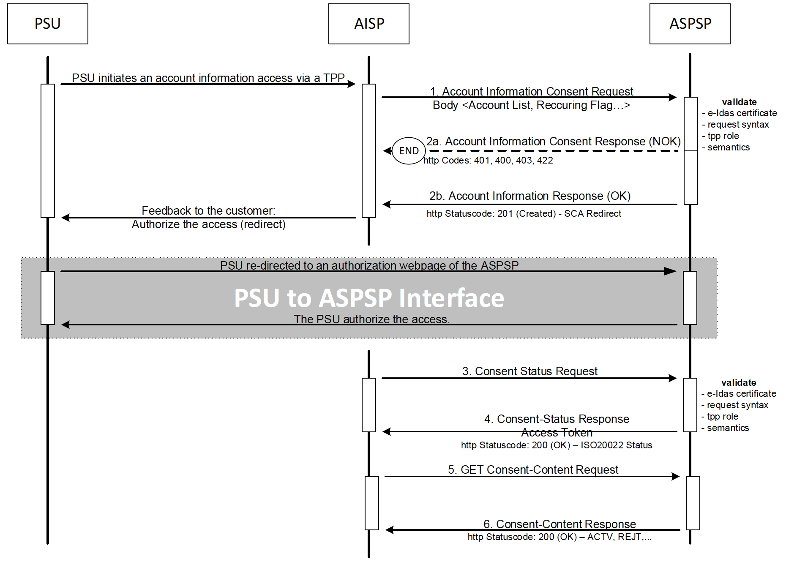
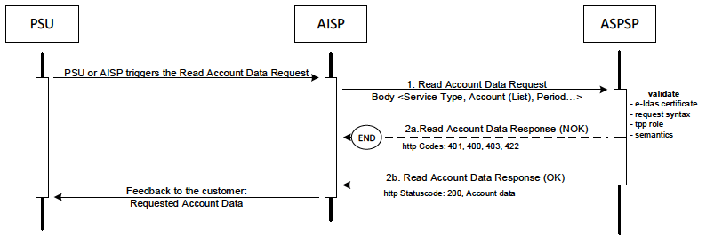

# XS2A interface –> Core services-> Payment Initiation Service

## AIS_01 Account Information Service (AIS).
This service may be used by an AISP to request information about the account of a PSU. The account is managed by the ASPSP providing the XS2A Interface.

### Account Information Service Flows
The Account Information Service is separated in two phases.

#### Account Information Consent  
PSU is giving consent on
  * the type type of Account Information Service to grant an access to,
  * the Multiplicity of the Account Information Service, i.e. a once-off or
      recurring access, and
  * in the latter case on the duration of the consent in days or as maximally
      offered by the ASPSP and optionally the frequency of a recurring request.
      

    With Redirect SCA Approach
    If the ASPSP supports the Redirect SCA Approach, the message flow within the Account
    Information Consent sub-service is simple. The Account Information Consent Request is
    followed by a redirection to the ASPSP SCA authorisation site. A status or content request
    on the created consent resource might be requested by the TPP after the session is reredirected
    to the TPP’s system.
    

#### Read Account Data  
The AISP gets access to the account data as defined by the PSU's consent. The Read Account Data Request will indicate 
  * the type of the account data to be accessed
  * in case of transaction reports additionally the addressed account number and the period of the transaction report 
  * the preferred formats of the transaction reports
    

### Data overview Account Information Service
The following table defines the technical description of the abstract data model as defined for the account information service. The columns give an overview on the API
protocols as follows:

* The **"Data element"** column is using the abstract data elements to deliver the connection to rules and role definitions.
* The **"Attribute encoding"** is giving the actual encoding definition within the XS2A API.
* The **"Location"** columns define, where the corresponding data elements are transported as https parameters, resp. are taken from e-IDas certificates. There are:
    * Path
    * Header
    * Body
    * Certificate
* The **"Usage"** column gives an overview on the usage of data elements in the different services and API Calls. These calls will be technically realised as HHTPS POST, PUT and GET commands. There are:
    * Information Consent Request
    * Information Consent Response
    * Update Data Request 
    * Update Data Response
    * Status Request
    * Status Response
    * Read Data Request
    * Read Data Response

The calls are divided into the following calls for Account Information:
* The Information Request which shall be the first API Call for every
      transaction within the corresponding XS2A Payment Initiation service. 
* The Update Data Call is a call, where the TPP needs to add PSU related
      data, which is requested in the return of the first call. This call might be
      repeated.
* The Get Data Request is the request to retrieve Account Information data.
* The Status Request is used in cases, where the SCA control is taken
      over by the ASPSP and the TPP needs later information about the
      outcome.

The following usage of abbreviations in the Location and Usage columns is defined:
* x: This data element is transported on the corresponding level.
* m: Mandatory
* o : Optional for the TPP to use
* c: Conditional. The Condition is described in the API Calls, condition defined by
  the ASPSP

| Data element                        | Attribute encoding                | Path | Header | Body | Certificate | Inf. Cons. Req. | Inf. Cons. Resp. | Upd. Req. | Upd. Resp. | Stat. Req. | Stat. Resp. | Read D. Req. | Read D. Resp. |
|-------------------------------------|-----------------------------------|:----:|:------:|:----:|:-----------:|:---------------:|:----------------:|:---------:|:----------:|:----------:|:-----------:|:------------:|:-------------:|
| Provider Identification             |                                   |   x  |        |      |             |        m        |                  |     m     |            |     m      |             |      m       |               | 
| TPP Registration Number             |                                   |      |        |      |      x      |        m        |                  |     m     |            |     m      |             |      m       |               |
| TPP Name                            |                                   |      |        |      |      x      |        m        |                  |     m     |            |     m      |             |      m       |               |
| TPP Role                            |                                   |      |        |      |      x      |        m        |                  |     m     |            |     m      |             |      m       |               |
| TPP National Competent Authority    |                                   |      |        |      |      x      |        m        |                  |     m     |            |     m      |             |      m       |               |
| Transaction Identification          | Process-ID                        |      |    x   |      |             |        m        |                  |     m     |            |     m      |             |      m       |               |
| Request Identification              | Request-ID                        |      |    x   |      |             |        m        |                  |     m     |            |     m      |             |      m       |               |
| Resource ID                         | Resource ID                       |   x  |        |      |             |                 |        m         |     m     |            |     m      |             |      m       |               |
| Access Token (from optional OAuth2) | Authorization Bearer              |      |    x   |      |             |        c        |                  |     c     |            |     c      |             |      c       |               |
| Request Timestamp                   | Date                              |      |    x   |      |             |        m        |                  |     m     |            |     m      |             |      m       |               |
| TPP Signing Certificate Data        | certificate                       |      |    x   |      |             |        c        |                  |     c     |            |     c      |             |      c       |               |
| TPP Signing Electronic Signature    | signature                         |      |    x   |      |             |        c        |                  |     c     |            |     c      |             |      c       |               |
| Further signature related data      |                                   |      |    x   |      |             |        c        |                  |     c     |            |     c      |             |      c       |               |
| Service Type                        |                                   |   x  |        |      |             |        m        |                  |     m     |            |     m      |             |      m       |               |
| Response Code                       |                                   |      |    x   |      |             |                 |        m         |           |     m      |            |     m       |              |      m        |
| Transaction Status                  | transaction_status                |      |        |  x   |             |                 |        m         |           |     m      |            |     m       |              |               |
| PSU Message Information             | psu_message                       |      |        |  x   |             |                 |        o         |           |     o      |            |     o       |              |      o        |
| TPP Message Information             | tpp_messages                      |      |        |  x   |             |                 |        o         |           |     o      |            |     o       |              |      o        |
| PSU Identification                  | PSU-ID                            |      |    x   |      |             |        c        |                  |     c     |            |            |             |              |               |
| Corporate Identification            | PSU-Corporate-ID                  |      |    x   |      |             |        c        |                  |     c     |            |     c      |             |              |               |
| PSU Password                        | psu_data.password                 |      |        |  x   |             |                 |                  |     c     |            |            |             |              |               |
| PSU Authentication Data             | psu_data.authentication           |      |        |  x   |             |                 |                  |           |            |            |             |              |               |
| SCA Challenge Data                  | sca_challenge_data                |      |        |  x   |             |                 |        c         |           |     c      |            |             |              |               |
| IP Address PSU                      | PSU-IP-Address                    |      |    x   |      |             |        m        |                  |           |            |            |             |              |               |
| PSU Agent                           | PSU Agent                         |      |    x   |      |             |        o        |                  |           |            |            |             |              |               |
| GEO Information                     | PSU-Geo-Location                  |      |    x   |      |             |        o        |                  |           |            |            |             |              |               |
| Redirect URL ASPSP                  | _links.redirect                   |      |        |  x   |             |                 |        c         |           |            |            |             |              |               |
| PSU Account                         | psu_account                       |      |        |  x   |             |                 |                  |           |            |            |             |      c       |               |
| PSU Account List                    | access_accounts                   |      |        |  x   |             |        m        |                  |           |            |            |             |              |               |
| Date From                           | date_from                         |   x  |        |      |             |                 |                  |           |            |            |             |      c       |               |
| Date To                             | date_to                           |   x  |        |      |             |                 |                  |           |            |            |             |      c       |               |
| Validity Period                     | valid_until                       |      |        |  x   |             |        m        |                  |           |            |            |             |              |               |
| Frequency                           | frequency_per_day                 |      |        |  x   |             |        m        |                  |           |            |            |             |              |               |
| Recurring Indicator                 | recurring_indicator               |      |        |  x   |             |        m        |                  |           |            |            |             |      c       |               |
| Combined service                    | combined_service_indicator        |      |        |  x   |             |        m        |                  |           |            |            |             |              |               |

### Account Information Consent Management
#### AIS_01_01 Consent Request

#### Consent Request on Dedicated Accounts

##### Call
    POST /v1/consents
Creates an account information consent resource at the ASPSP regarding access to accounts specified in this request.

##### Request Header

| Attribute | Type  | Condition | Description |
|--------|------------------|----------|---------|
| Process-ID	| UUID	|Mandatory|	ID of the transaction as determined by the initiating party|
| Request-ID	| UUID|  	Mandatory	| ID of the request, unique to the call, as determined by the initiating party.|
| PSU-ID|	String	|Conditional	|Might be mandated in the ASPSP’s documentation. Is not contained if the optional OAuth Pre-Step was performed.|
| PSUCorporate-ID |	String |	Conditional |	Might be mandated in the ASPSP's documentation. Only used in a corporate context. |
| Authorization Bearer |	String |	Conditional |	Is contained only, if the optional OAuth2 Pre-Step was performed to get the agreement of the PSU. |
| signature	| String ("details t.b.d." in the original specification) |	Conditional |	A signature of the request by the TPP on application level. This might be mandated by ASPSP. |
| certificate	|String ("details t.b.d." in the original specification) |	Conditional	| The certificate used for signing the request. |
| Date |	DateTime	| Mandatory	| Standard https header element for date and time of the TPP Request. |

##### Request body

| Attribute | Type  | Condition | Description |
|--------|------------------|----------|---------|
| access_accounts	| Array of single account access | Mandatory | Requested access service per account. |
| recurring_indicator | boolean | Mandatory | "true", if the consent is for recurring access to the account data or "false", if the consent is for one access to the account data |
| valid_until | String | Mandatory | This parameter is requesting a valid until date for the requested consent. The content is the local ASPSP date in ISODate Format, e.g. 2017-10-30 |
| frequency_per_day | Integer | Mandatory | This field indicates the requested maximum frequency for an access per day. For a once-off access, this attribute is set to "1". |
| combined_service_indicator | boolean | Mandatory | If "true" indicates that a payment initiation service will be addressed in the same "session". |

##### Response Header    
The Location field is used as link to the status of the created resource. No other specific requirements.

##### Response Body
| Attribute | Type  | Condition | Description |
|--------|------------------|----------|---------|
| sca_methods | Array of authentication objects |	conditional |	This data element might be contained, if SCA is required and if the PSU has a choice between different authentication methods. Depending on the risk management of the ASPSP this choice might be offered before or after the PSU has been identified with the first relevant factor, or if an access token is transported. If this data element is contained, then there is also an hyperlink of type "select_authentication_methods" contained in the response body. These methods shall be presented towards the PSU for selection by the TPP. |
| chosen_sca_method | authentication object  |	conditional |	This data element is only contained in the response if the APSPS has chosen the Embedded SCA Approach, if the PSU is already identified with the first relevant factor or alternatively an access token, if SCA is required and if the authentication method is implicitly selected.  |
| sca_challenge_data | challenge | conditional | It is contained in addition to the data element chosen_sca_method if challenge data is needed for SCA. 
| _links | links  |	Mandatory |	A list of hyperlinks to be recognized by the TPP. Type of links admitted in this response, (further links might be added for ASPSP defined extensions): *"redirect"* : In case of an SCA Redirect Approach, the ASPSP is transmitting the link  to which to redirect the PSU browser. *"update_psu_identification"* : The link to the payment initiation resource, which needs to be updated by the psu identification. This  might be used in a redirect or decoupled approach, where the PSU ID was missing in the first request. *"update_psu_authentication"* : The link to the payment initiation resource, which need to be updated by a psu password and  eventually the psu identification if not delivered yet. This is used in a case of the Embedded SCA approach.  *"select_authentication_method"* : This is a link to a resource, where the TPP can select  the applicable strong customer authentication methods for the PSU, if there  were several available authentication methods. This link contained under exactly the same conditions as the data element “authentication_methods”, see above. *“status”*: The link to retrieve the transaction status of the payment initiation |
| psu_message | string  |	Optional | Text to be displayed to the PSU |

##### Example

*Request*

    POST https://api.testbank.com/v1/consents
    Content-Encoding        gzip
    Content-Type            application/json
    Process-ID              3dc3d5b3-7023-4848-9853-f5400a64e80g
    Request-ID              99391c7e-ad88-49ec-a2ad-99ddcb1f7756
    PSU-IP-Address          192.168.8.78
    PSU-Agent               Mozilla/5.0 (Windows NT 10.0; WOW64; rv:54.0)
    Gecko/20100101 Firefox/54.0
    Date                    Sun, 06 Aug 2017 15:02:37 GMT
    {
     "access_accounts": [
        {"iban": "DE2310010010123456789",
         "access" : ["balance","transactions"]},
        {"iban": "DE2310010010123456788",
         “access” :[“balance”],
        {"pan": "12345678912345",
         "access": ["transactions"] }
     ],
     "recurring_indicator": "true",
     "valid_until": "2017-11-01",
     "frequency_per_day" : "4"
    }

*Response in case of a redirect*

    Response Code 200

*Response Header*

    Location "v1/consents/1234-wertiq-983"

*Response Body*

    {
     "transaction_status" : "Received",
     "_links" {
     "redirect" : "www.testbank.com/authentication/1234-wertiq-983"
    }
    
    
    
#### Consent Request on Account List

##### Call
    POST /v1/consents/account-list
Creates an account information consent resource at the ASPSP to return a list of all accessible accounts.

##### Request Header

| Attribute | Type  | Condition | Description |
|--------|------------------|----------|---------|
| Process-ID	| UUID	|Mandatory|	ID of the transaction as determined by the initiating party|
| Request-ID	| UUID|  	Mandatory	| ID of the request, unique to the call, as determined by the initiating party.|
| PSU-ID|	String	|Conditional	|Might be mandated in the ASPSP’s documentation. Is not contained if the optional OAuth Pre-Step was performed.|
| PSUCorporate-ID |	String |	Conditional |	Might be mandated in the ASPSP's documentation. Only used in a corporate context. |
| Authorization Bearer |	String |	Conditional |	Is contained only, if the optional OAuth2 Pre-Step was performed to get the agreement of the PSU. |
| signature	| String ("details t.b.d." in the original specification) |	Conditional |	A signature of the request by the TPP on application level. This might be mandated by ASPSP. |
| certificate	|String ("details t.b.d." in the original specification) |	Conditional	| The certificate used for signing the request. |
| Date |	DateTime	| Mandatory	| Standard https header element for date and time of the TPP Request. |

##### Request body

| Attribute | Type  | Condition | Description |
|--------|------------------|----------|---------|
| with-balance | boolean | Mandatory | If the value equals "true", then the consent request is on the list of all payment accounts inclusive the balance. If the value equals "false", then the consent request is on the list of accounts only. |

##### Response Body

    Location is under /v1/consents

    
    
#### AIS_01_02 Get Status Request 

##### Call

    GET /v1/consents/{consent-id}/status
Can check the status of an account information consent resource.

##### Path

| Attribute | Type  | Description |
|--------|------------------|----------|
| resource-ID | String |  |

##### Request Header
See Request Header under AIS_01_01.

##### Request Body
No body.

##### Response Body

| Attribute | Type  | Condition | Description |
|--------|------------------|----------|---------|
| transaction_status |  |  | This is the "authentication status" of the consent. 

##### Example

*Request*
    
    GET https://api.testbank.com/v1/consents/qwer3456tzui7890/status
    
 
 *Response*
 
    Response Code 200
    
    {
     "transaction_status" : "AcceptedTechnicalValidation",
    }
    

#### AIS_01_03 Get Consent Request 

##### Call

    GET /v1/consents/{consent-id}
    
Returns the content of an account information consent object. This is returning the data for the TPP especially in cases, where the consent was directly managed between ASPSP and PSU e.g. in a re-direct SCA Approach.

##### Path

| Attribute | Type  | Description |
|--------|------------------|----------|
| consent-id | String | ID of the corresponding consent object as returned by Account Information Consent Request |

##### Request Header
See Request Header under AIS_01_01. 

##### Request Body
No body.

##### Response Body

| Attribute | Type  | Condition | Description |
|--------|------------------|----------|---------|
| access_accounts | Array of single account access | Mandatory | |
| recurring_indicator | boolean | Mandatory | "true", if the consent is for recurring access to the account data or "false", if the consent is for one access to the account data |
| valid_until | String | Mandatory | This parameter is a valid until date for the requested consent. The content is the local ASPSP date in ISODate Format, e.g. 2017-10-30 |
| frequency_per_day | Integer | Mandatory | This field indicates the requested maximum frequency for an access per day. For a once-off access, this attribute is set to "1". |
| transactions_status | String | Mandatory | This is the "authentication status" of the consent. |
| consent-status | String | Mandatory | The following code values are permitted "empty", "valid", "blocked", "expired", "deleted". These values might be extended by ASPSP by more values. |

##### Example

*Request*
    
    GET https://api.testbank.com/v1/consents/qwer3456tzui7890?
    
*Response* 

    {
     "access_accounts": [
        {"iban": "DE2310010010123456789",
         "access" : ["balance","transactions"]},
        {"iban": "DE2310010010123456788",
         "access" :["balance"],
        {"pan": "12345678912345",
         "access": ["transactions"] }
     ],
     "recurring_indicator": "true",
     "valid_until": "2017-11-01",
     "frequency_per_day" : "4",
     "transaction_status" : "AcceptedTechnicalValidation",
     "consent_status": "valid"
    }

#### AIS_01_04 Delete Account Information Consent Object

##### Call

    DELETE /v1/consents/{consent-id}
Deletes a given consent.

##### Path

| Attribute | Type  | Description |
|--------|------------------|----------|
| consent-id | String | Contains the resource id of the consent to be deleted. |

##### Request Header

| Attribute | Type  | Condition | Description |
|--------|------------------|----------|---------|
| Process-ID | UUID | Mandatory | ID of the transaction as determined by the initiating party.. |
| Request-ID | UUID | Mandatory | |
| Authorization Bearer | String | Conditional | Is contained only, if the optional OAuth Pre-Step was performed. |

##### Request Body
No body.

##### Response Body
No body.

##### Example

*Request*
    
    DELETE https://api.testbank.com/v1/consents/qwer3456tzui7890
    Content-Encoding    gzip
    Content-Type        application/json
    Process-ID          3dc3d5b3-7023-4848-9853-f5400a64e812
    Request-ID          99391c7e-ad88-49ec-a2ad-99ddcb1f7757
    Date                Sun, 13 Aug 2017 17:05:37 GMT
    
 
 *Response*
 
    Response Code 204
    
#### AIS_01_05 Read Account Data Request

#### AIS_01_05_01 Read Account List

##### Call

    GET /v1/accounts/{path-options}
Reads a list of accounts. It is assumed that a consent of the PSU to this access is already given and stored on the ASPSP system. The adressed list of accounts depends then on the PSU ID and the stored consent addressed by consent-id, respectively the OAuth2 Token.
  
  
##### Path

| Attribute | Type  | Description |
|--------|------------------|----------|
| with-balance | String | If it is contained, this function reads the list of accessible payment accounts including the balance. |
| psu-involved | String | If contained, it is indicated that a PSU has directly asked this account access in real-time. The PSU then might be involved in an additional consent process, if the given consent is not any more sufficient. |

##### Request Header

| Attribute | Type  | Condition | Description |
|--------|------------------|----------|---------|
| Process-ID	| UUID	|Mandatory|	ID of the transaction as determined by the initiating party|
| Request-ID	| UUID|  	Mandatory	| ID of the request, unique to the call, as determined by the initiating party.|
| Consent-ID | String | Conditional | Shall be contained if "Establish Consent Transaction" was performed via this API before. |
| PSU-ID|	String	|Conditional	| Might be mandated in the ASPSP’s documentation. Is not contained if the optional OAuth Pre-Step was performed.|
| Authorization Bearer |	String |	Conditional |	Is contained only, if the optional OAuth2 Pre-Step was performed. |

##### Response Body

| Attribute | Type  | Condition | Description |
|--------|------------------|----------|---------|
| account_list | Array of account | Mandatory | |

##### Example

*Response*
   
    {[
       {"id" : "3dc3d5b3-7023-4848-9853-f5400a64e80f",
        "iban” : "DE2310010010123456789",
        "account_type" : "Main Account",
        "currency" : “EUR”
        "_links" : {
            "balances" : "/v1/accounts/3dc3d5b3-7023-4848-9853-f5400a64e80f/balances",
            "transactions" : "/v1/accounts/3dc3d5b3-7023-4848-9853-f5400a64e80f/transactions"}
       },
       {"id" : "3dc3d5b3-7023-4848-9853-f5400a64e81g",
        "iban": "DE2310010010123456788",
        "account_type" : "US Dollar Account",
        "currency" : "USD",
        "_links" : {
            "balances" : "/v1/accounts/3dc3d5b3-7023-4848-9853-f5400a64e81g/balances" }
       },
       {"id" : "1234567890-12345",
        "pan" : "1234567890-12345",
        "account_type": "Credit Card",
        "currency" : "EUR",
        "_links" : {
            "transactions" : "/v1/accounts/1234567890-12345/transactions" }
        }
    ]}
    

### AIS_01_05_02 Read Balance

##### Call

    GET /v1/accounts/{account-id}/balances
Reads account data from a given account addressed by "account-id". 

Remark: This account-id can be a tokenized identification due to data protection reason.

##### Path

| Attribute | Type  | Description |
|--------|------------------|----------|
| account-id | String | This identification is denoting the addressed account. The account-id is retrieved by using a "Read Account List" call. The account-id is the “id” attribute of the account structure. Its value is constant at least throughout the lifecycle of a given consent.

##### Request Header

| Attribute | Type  | Condition | Description |
|--------|------------------|----------|---------|
| Process-ID	| UUID	|Mandatory|	ID of the transaction as determined by the initiating party. In case of a once off read data request, this Process-ID equals the Process-ID of the corresponding Account Information Consent Request.|
| Request-ID	| UUID|  	Mandatory	|  |
| Consent-ID | String | Conditional |  |
| PSU-ID|	String	|Conditional	| To be used, if no OAuth Pre-Step was performed and if a list of account balances or a list of accounts is requested.|
| Authorization Bearer |	String |	Conditional |	Is contained only, if the optional OAuth2 Pre-Step was performed. |
| signatue | details t.b.d. | Conditional | A signature of the request by the TPP on application level. This might be mandated by ASPSP. |
| certificate | details t.b.d | Conditional | The certificate used for signing the request. |
| Date | DateTime | Mandatory | Standard https header element for Date and Time |

##### Request Filter Parameters in Path

| Attribute | Type  | Description |
|--------|------------------|----------|
|psu-involved | String | If contained, it is indicated that a PSU has directly asked this account in realtime. The PSU then might be involved in an additional consent process, if the given consent is not any more sufficient. |

##### Response Body

| Attribute | Type  | Condition | Description |
|--------|------------------|----------|---------|
| balances | balances | Mandatory | A list of balances regarding this account, e.g. the current balance or the last booked balance. |

##### Example

*Response*

     {
      "Balances" :
         {"closed_booked" :
            {
            "Amount" : {"currency" : "EUR", "500.00"},
            "Date" : "2017-10-25"
            },
         {"expected" :
            {
            "amount" : {"currency" : "amount" : "900.00"},
            "last_action_date_time" : "2017-10-25T15:30:35.035Z"
            }
         }
     }
     

### AIS_01_05_02 Read Transaction List

##### Call

     GET /v1/accounts/{account-id}/transactions {parameter-option}
Reads account data from a given account addressed by "account-id".

Remark: If the ASPSP is not providing the "GET Account List" call, then the ASPSP must accept e.g. the PSU IBAN as account-id in this call.

##### Path

| Attribute | Type  | Description |
|--------|------------------|----------|
| account-id | String | This identification is denoting the addressed account. The account-id is retrieved by using a "Read Account List" call. The account-id is the “id” attribute of the account structure. Its value is constant at least throughout the lifecycle of a given consent.

##### Request Header

| Attribute | Type  | Condition | Description |
|--------|------------------|----------|---------|
| Process-ID	| UUID	|Mandatory|	ID of the transaction as determined by the initiating party. In case of a once off read data request, this Process-ID equals the Process-ID of the corresponding Account Information Consent Request.|
| Request-ID	| UUID|  	Mandatory	|  |
| Consent-ID | String | Conditional | Mandatory, if a consent was managed within this interface on /v1/consents for the access of this account. |
| PSU-ID|	String	|Conditional	| To be used, if no OAuth Pre-Step was performed and if a list of account balances or a list of accounts is requested.|
| Authorization Bearer |	String |	Conditional |	Is contained only, if the optional OAuth2 Pre-Step was performed. |
| Accept | String | Conditional | The TPP can indicate the formats of account reports supported together with a priorisation following the http header definition. The supported formats are XML, JSON and text. |   
| signatue | details t.b.d. | Conditional | A signature of the request by the TPP on application level. This might be mandated by ASPSP. |
| certificate | details t.b.d | Conditional | The certificate used for signing the request. |
| Date | DateTime | Mandatory | Standard https header element for Date and Time |

##### Request Filter Parameters in Path

| Attribute | Type  | Condition | Description |
|--------|------------------|----------|---------|
| date_from | ISODate | Mandatory | Starting date of the account statement |
| date_to | ISODate | Mandatory | End date of the account statement. It is contained is this is a Read Account Data Request for transaction reports. |
| transaction_id | String | Optional | Implementation of a delta-report: the data attribute is indicating that the AISP is in favour to get all transactions after the transaction with identification transaction_id alternatively to the above defined period. If this data element is contained, the entries "date_from" and "date_to" might be ignored by the ASPSP if a delta report is supported. |
| psu-involved | Boolean | String | If contained, it is indicated that a PSU has directly asked this account in realtime. The PSU then might be involved in an additional consent process, if the given consent is not any more sufficient. |

##### Response Header

Content-Type: application/json or application/xml or application/

##### Response Body

In case the ASPSP returns a camt.05x XML structure, the response body consists of either a camt.052 or camt.053 format. The camt.052 may include pending payments which are not yet finally booked. The ASPSP will decide on the format due to the chosen parameters, specifically on the chosen dates relative to the time of the request. 

In case the ASPSP returns a MT94x content, the response body consists of an MT940 or MT942 format in a text structure. The camt.052 may include pending payments which are not yet finally booked. The ASPSP will decide on the format due to the chosen parameters, specifically on the chosen dates relative to the time of the request. 

A JSON response is defined as follows:

| Attribute | Type  | Condition | Description |
|--------|------------------|----------|---------|
| _links | links | Optional | A list of hyperlinks to be recognized by the TPP. Admitted types of links are "download" (link to a resource, where the transaction report might be downloaded from). This feature shall be only used where camt-data is requested which has a huge size. |
| transactions | Account Report | Optional | JSON based account report. |

##### Example 

*Request*

    GET https://api.testbank.com/v1/accounts/qwer3456tzui7890/transactions?date_from="2017-07-01"&date_to= “2017-07-30”&psu-involved
    Accept: application/json, application/text;q=0.9, application/xml;q=0.8 

*Response in JSON format*

Response Code 200

    {“transactions” :
       {“booked” :
          [{
             "transaction_id" : "12345672" ,
             "creditor_name" : "John Miles" ,
             "creditor_account" : {"iban" : "DE43533700240123456900"},
             "Amount” : {"currency" : "EUR", "content" : "-256,67"} ,
             "booking_date" : "2017-10-25" ,
             "value_date" : "2017-10-26" ,
             "remittance_information_unstructured" : "Example for Remittance Information"
          },
          {
             "transaction_id" : "1234568",
             "debtor_name" : "Paul Simpson" ,
             "debtor_account" : {"iban" : "NL354543123456900"} ,
             "amount" : {"currency" : "EUR", content: "343,01"} ,
             "booking_date" : "2017-10-25" ,
             "value_date" : "2017-10-26" ,
             "remittance_information_unstructured" : "Another example for Remittance Information"
          }],
       },
       {"pending" :
          [{
             "transaction_id" : "1234569" ,
             "creditor_name" : "Claude Renault" ,
             "creditor_account : {"iban" : "FR33554543123456900"},
             "amount” : {"currency" : "EUR", "content" : "-100,03"} ,
             "value_date" : "2017-10-26" ,
             "remittance_information_unstructured" : "Third Example for Remittance Information"
          }]
       },
       {"_links":
          {"account-link" : "/v1/accounts/3dc3d5b3-7023-4848-9853-f5400a64e80f"}
       }
    }
    
*Response in case of a huge data amount as download*

    {
       "_links : {"download" : www.testapi.com/xs2a/v1/accounts/12345678999/transactions/download/}
    }