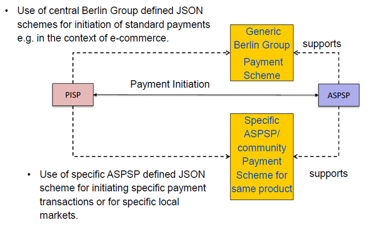

# XS2A interface –> Core services-> Payment Initiation Service

## PIS_01 Payment Initiation Service (PIS).
This service may be used by a PISP to initiate a single payment on behalf of a PSU using a given account of that PSU. The account is managed by the ASPSP providing the XS2A Interface.

	With Redirect SCA Approach
	If the ASPSP supports the Redirect SCA Approach, the message flow within the payment
	initiation service is simple. The Payment Initiation Request is followed by a redirection to the
	ASPSP SCA authorization site. A status request might be requested by the TPP after the
	session is re-redirected to the TPP’s system.

Transactions according to this use case can be used to initiate a single payment in form of a credit transfer from an account of the PSU to an account of the payee.
Transactions according to this use case can be used to initiate a single payment in form of a credit transfer from an account of the PSU to an account of the payee.

### Data Overview Payment Initiation Service

The following table defines the technical description of the abstract data model for the Payment Initiation service. The columns give an overview on the API protocols as follows:

* The **"Data element"** column is using the abstract data elements to deliver the connection to rules and role definitions.
* The **"Attribute encoding"** is giving the actual encoding definition within the XS2A API.
* The **"Location"** columns define, where the corresponding data elements are transported as https parameters, resp. are taken from e-IDas certificates. There are:
    * Path
    * Header
    * Body
    * Certificate
* The **"Usage"** column gives an overview on the usage of data elements in the different services and API Calls. These calls will be technically realised as HHTPS POST, PUT and GET commands. There are:
    * Init Req.
    * Init Resp.
    * Upd. Req.
    * Upd. Resp.
    * Stat. Req.
    * Stat. Resp

The calls are divided into the following calls for Payment Initiation:
* The Initiation Request which shall be the first API Call for every
      transaction within the corresponding XS2A service Payment Initiation. This
      call generates the corresponding resource within the Payment Initiation
      Service.
* The Update Data Call is a call, where the TPP needs to add PSU related
      data, which is requested in the return of the first call. This call might be
      repeated.
* The Status Request is used e.g. in cases, where the SCA control is taken
      over by the ASPSP and the TPP needs later information about the
      outcome.

The following usage of abbreviations in the Location and Usage columns is defined:
* x: This data element is transported on the corresponding level.
* m: Mandatory
* o : Optional for the TPP to use
* c: Conditional. The Condition is described in the API Calls, condition defined by
  the ASPSP

| Data element                        | Attribute encoding                | Path | Header | Body | Certificate | Init Req. | Init Resp. | Upd Req. | Upd Resp. | Stat Req. | Stat Resp. |
|-------------------------------------|-----------------------------------|:----:|:------:|:----:|:-----------:|:---------:|:----------:|:--------:|:---------:|:---------:|:----------:|
| TPP RegistrationNumber              |                                   |      |        |      |      x      |     m     |            |     m    |           |     m     |            |
| TPP Name                            |                                   |      |        |      |      x      |     m     |            |     m    |           |     m     |            |
| TPP Roles                           |                                   |      |        |      |      x      |     m     |            |     m    |           |     m     |            |
| TPP NationalCompetent Authority     |                                   |      |        |      |      x      |     m     |            |     m    |           |     m     |            |
| TransactionIdentification           | Process-ID (unique id of TPP)     |      |    x   |      |             |     m     |            |     m    |           |     m     |            |
| RequestIdentification               | Request-ID                        |      |    x   |      |             |     m     |            |     m    |           |     m     |            |
| Resource ID                         | Resource-ID as part of ahyperlink |   x  |        |   x* |             |           |      m     |     m    |           |     m     |            |
| Access Token (fromoptional OAuth 2) | Authorization Bearer              |      |    x   |      |             |     c     |            |     c    |           |     c     |            |
| Request Timestamp                   | Date                              |      |    x   |      |             |     m     |            |     m    |           |     m     |            |
| TPP SigningCertificate Data         | certificate                       |      |    x   |      |             |     c     |            |     c    |           |     c     |            |
| TPP ElectronicSignature             | signature                         |      |    x   |      |             |     c     |            |     c    |           |     c     |            |
| Further signaturerelated data       |                                   |      |    x   |      |             |     c     |            |     c    |           |     c     |            |
| Service Type                        |                                   |   x  |        |      |             |     m     |            |     m    |           |     m     |            |
| Response Code                       |                                   |      |    x   |      |             |           |      m     |          |     m     |           |      m     |
| Transaction Status                  | transaction_status                |      |        |   x  |             |           |      m     |          |     m     |           |      m     |
| PSU Message Information             | psu_message                       |      |        |   x  |             |           |      o     |          |     o     |           |      o     |
| TPP Message Information             | tpp_messages                      |      |        |   x  |             |           |      o     |          |     o     |           |      o     |
| PSU Identification                  | PSU-ID                            |      |    x   |      |             |     c     |            |     c    |           |           |            |
| Corporate Identification            | Corporate-ID                      |      |    x   |      |             |     c     |            |     c    |           |     c     |            |
| Corporate ID Type                   | Corporate-ID-Type                 |      |    x   |      |             |     c     |            |     c    |           |     c     |            |
| PSU Password                        | psu_data.password                 |      |        |   x  |             |           |            |     c    |           |           |            |
| PSU Authentication Data             | sca_authentication_data           |      |        |   x  |             |           |            |          |           |           |            |
| SCA Challenge Data                  | sca_challenge_data                |      |        |   x  |             |           |      c     |          |     c     |           |            |
| IP Address PSU                      | PSU-IP-Address                    |      |    x   |      |             |     m     |            |          |           |           |            |
| PSU User Agent                      | PSU-User-Agent*                   |      |    x   |      |             |     o     |            |          |           |           |            |
| GEO Information                     | PSU-Geo-Location                  |      |    x   |      |             |     o     |            |          |           |           |            |
| Additional Device Information       | PSU-Additional-Device-Information |      |    x   |      |             |     o     |            |          |           |           |            |
| Redirect URL ASPSP                  | _links.redirect                   |      |        |   x  |             |           |      c     |          |           |           |            |
| Payment Product                     | payment-product                   |   x  |        |      |             |     m     |            |     m    |           |     m     |            |

x* - Is transported in body only in response message.

PSU-User-Agent* - This field transports key information for risk management like browser type or PSU device operating system

## Payment Initiation with JSON encoding of the Payment Instruction
### PIS_01_01 Call

**Endpoint POST**
   * 	/v1/payments/{product-name}

**Product-name**
*	sepa-credit-transfers
*	instant-sepa-credit-transfers
*	target-2-payments
*	cross-border-credit-transfers

    POST /v1/payments/{payment-product}
Creates a payment initiation request at the ASPSP.

### Path

Attribute | Type  | Description |
------- | ---------------- |  :---------
Payment-product  | string | The addressed payment product endpoint, e.g. for SEPA Credit Transfers (SCT). The default list of products supported in this standard is:  sepa-credit-transfers, instant-sepa-credit-transfers, target-2-payments, cross-border-credit-transfers |

### Request Header

Attribute | Type  | Condition | Description |
------- | ---------------- |  :---------  |  :---------
| Content-Type	| string |	Mandatory |	application/json |
|Process-ID	| UUID	|Mandatory|	ID of the transaction as determined by the initiating party|
|Request-ID	| UUID|  	Mandatory	| ID of the request, unique to the call, as determined by the initiating party.|
|PSU-ID|	string	|Conditional	|Might be mandated in the ASPSP’s documentation. Is not contained if the optional OAuth Pre-Step was performed.|
| PSUCorporate-ID |	String |	Conditional |	Might be mandated in the ASPSP's documentation. Only used in a corporate context. |
| Authorization Bearer |	String |	Conditional |	Is contained only, if the optional OAuth2 Pre-Step was performed. |
| Consent-ID |	String |	Optional |	This data element may be contained, if the payment initiation transaction is part of acombined AIS/PIS service. This then contains the consent id of the related AIS consent. |
| PSU-Agent |	String	| Optional |	The forwarded Agent header field of the http request between PSU and TPP. |
| PSU-IPAddress | String	| Mandatory |	The forwarded IP Address header field consists of the corresponding http request IP Address field between PSU and TPP. |
| PSU-Geo-Location	| String	| Optional |	The forwarded Geo Location header field of the corresponding http request between PSU and TPP if available. |
| signature	| String ("details t.b.d." in the original specification) |	Conditional |	A signature of the request by the TPP on application level. This might be mandated by ASPSP. |
| certificate	|String ("details t.b.d." in the original specification) |	Conditional	| The certificate used for signing the request. |
| Date |	DateTime	| Mandatory	| Standard https header element date and time |

###  Request Body
The payment data to be transported in the request body are dependent of the chosen API
endpoint. Some standard definitions related to the above mentioned standard products are
defined below. Further definitions might be done community or ASPSP specific. ASPSP or
community definitions should reuse standard attribute names.

For core payment products in the European market, this document is defining JSON
structures, which will be supported by all ASPSPs
* offering the corresponding payment products to their customers and
* providing JSON based payment endpoints

At the same time, the ASPSP may offer in addition more extensive JSON structures for the
same payment products since they might offer these extensions also in their online banking
system.

The following table first gives an overview on the generic Berlin Group defined JSON
structures of standard SEPA payment products.

Data Element | Type  | SCT EU Core | SCT_INST EU Core | Target2  Paym. Core | Cross  Curr CT Core |
------- | ---------------- |  ---------  |  --------- |  --------- |  ---------
| end_to_end_identification	| String |	Optional |	Optional | Optional | n.a. |
| debtor_account (incl. type)	| Account Reference |	mandatory |	mandatory | mandatory | mandatory |
| debtor_account_currency	| CODE |	n.a. |	n.a. | n.a. | optional |
| ultimate_debtor	| String |	n.a. |	n.a. | n.a. | n.a. |
| instructed_amount (inc. Curr.)	| Amount |	mandatory |	mandatory | mandatory | mandatory |
| creditor_account	| Account Reference  |	mandatory |	mandatory | mandatory | mandatory |
| creditor_agent	| BICFI |	Optional |	Optional | Optional | Optional |
| creditor name	| String |	mandatory |	mandatory | mandatory | mandatory |
| creditor address	| Address |	Optional |	Optional | Optional | mandatory |
| ultimate_creditor | String |	 n.a. |	 n.a. |  n.a. | n.a. |
| purpose_code	| CODE |	 n.a. |	 n.a. |  n.a. | n.a. |
| remittance_information_unstructured	| String |	Optional |	Optional | Optional | Optional |
| remittance_informationstructured	| Remittance |	n.a. |	n.a. | n.a. | n.a. |
| requested_execution	| DateTime |	n.a. |	n.a. | n.a. | n.a. |

**Remark:** Extensions of these tables are permitted by this specification:
* if they are less restrictive (e.g. set the debtor account to optional) or
* if they open up for more data elements (e.g. open up the structured remittance information, or ultimate data fields.

          Attention: The ASPSP may reject a payment initiation request where additional data elements are used which are not specified.

### Response Header
The Location field is used as link to the created resource. No other specific requirements.

###  Response Body

Attribute | Type  | Condition | Description |
------- | ---------------- |  ---------  |  ---------
| transaction_status | Transaction status  |	Mandatory |	The values defined in the table “Transaction Status” (see below) might be used. |
| sca_methods | Array of authentication objects |	conditional |	This data element might be contained, if SCA is required and if the PSU has a choice between different authentication methods. Depending on the risk management of the ASPSP this choice might be offered before or after the PSU has been identified with the first relevant factor, or if an access token is transported. If this data element is contained, then there is also an hyperlink of type "select_authentication_methods" contained in the response body. These methods shall be presented towards the PSU for selection by the TPP. |
| chosen_sca_method | authentication object  |	conditional |	This data element is only contained in the response if the APSPS has chosen the Embedded SCA Approach, if the PSU is already identified with the first relevant factor or alternatively an access token, if SCA is required and if the authentication method is implicitly selected.  |
| _links | links  |	Mandatory |	A list of hyperlinks to be recognized by the TPP. **Remark:**  All links can be relative or full links, to be decided by the ASPSP. Type of links admitted in this response, (further links might be added for ASPSP defined extensions): *"redirect"* : In case of an SCA Redirect Approach, the ASPSP is transmitting the link  to which to redirect the PSU browser. *"update_psu_identification"* : The link to the payment initiation resource, which needs to be updated by the psu identification. This  might be used in a redirect or decoupled approach, where the PSU ID was missing in the first request. *"update_psu_authentication"* : The link to the payment initiation resource, which need to be updated by a psu password and  eventually the psu identification if not delivered yet. This is used in a case of the Embedded SCA approach.  *"select_authentication_method"* : This is a link to a resource, where the TPP can select  the applicable strong customer authentication methods for the PSU, if there  were several available authentication methods. This link contained under exactly the same conditions as the data element “authentication_methods”, see above. *"self"* : The link to the payment initiation resource created by this request. This link can be used to retrieve the resource data. “status”: The link to retrieve the transaction status of the payment initiation |
| psu_message | string  |	Optional | Text to be displayed to the PSU |
| tpp_messages | Array of Message |   Optional	 |  |

#### Transaction Status

Code | Name | ISO 20022 Definition |
------- | ---------------- |  ---------
| ACCP |  AcceptedCustomerProfile |	Preceding check of technical validation was successful. Customer profile check was also successful. |
| ACSC | AcceptedSettlementCompleted | Settlement on th’ debtor's account has been completed.  Usage : this can be used by the first agent to report to  the debtor that the transaction has been completed.  Warning : this status is provided for transaction status  reasons, not for financial information. It can only be used after bilateral agreement  |
| ACSP | AcceptedSettlementInProcess | All preceding checks such as technical validation and customer profile were successful and therefore the payment initiation has been accepted for execution. |
| ACTC | AcceptedTechnicalValidation | Authentication and syntactical and semantical validation are successful |
| ACWC | AcceptedWithChange | Instruction is accepted but a change will be made, such as date or remittance not sent. |
| ACWP | AcceptedWithoutPosting | Payment instruction included in the credit transfer is accepted without being posted to the creditor  customer’s account. |
| RCVD | Received | Payment initiation has been received by the receiving  agent. |
| PDNG | Pending | Payment initiation or individual transaction included in  the payment initiation is pending. Further checks and  status update will be performed. |
| RJCT | Rejected | Payment initiation or individual transaction included in   the payment initiation has been rejected. |

If the response is JSON based, then the Name entry is used, to get a better readability.

### Example

*Request*

    POST https://api.testbank.com/v1/payments/sepa-credit-transfers
    Content-Encoding gzip
    Content-Type application/json
    Process-ID 3dc3d5b3-7023-4848-9853-f5400a64e80f
    Request-ID 99391c7e-ad88-49ec-a2ad-99ddcb1f7721
    PSU-IP-Address 192.168.8.78
    PSU-Agent Mozilla/5.0 (Windows NT 10.0; WOW64; rv:54.0)
    Gecko/20100101 Firefox/54.0
    Date Sun, 06 Aug 2017 15:02:37 GMT
    {
    "instructed_amount” : {“currency” : “EUR” , “amount” : "123"},
    "debtor_account" : { "iban":"DE2310010010123456789"},
    “creditor” : { “name” : “Merchant123”} ,
    "creditor_account”: {“iban”:“DE23100120020123456789”},
    “remittance_information_unstructured” : “Ref Number Merchant-
    123456”
    }

*Response in case of a redirect*

    Response Code 201

*Response Body*

        {
        "transaction_status" : "Received",
        “_links" {
        "redirect" : "www.testbank.com/asdfasdfasdf",
        "self" : "/v1/payments/sepa-credit-transfers/1234-
        wertiq-983"
                }
        }

## PIS_01_02 Get Status Request

### Call
    GET /v1/payments/{payment-product}/{resource-id}/status

Can check the status of a payment initiation.

### Path

Attribute | Type |
------- | ----------------
| payment-product |  string  |
| resource-id |  string  |

### Request Header

Attribute | Type | Condition | Description |
------- | ---------------- | ---------------- | ----------------
| Request-ID |  UUID  | Mandatory | |
| Process-ID |  UUID  | Mandatory | |
| Authorization Bearer |  String  | Conditional | Is contained only, if the optional OAuth Pre-Step was performed  |
| signature |  details  t.b.d.  | Conditional | A signature of the request by the TPP on  application level. This might be mandated by ASPSP. |
| certificate |  details  t.b.d. | Conditional | The certificate used for signing the request. |
| Date |  DateTime | Mandatory | Standard http date and time tag. |

### Request Body
No body.

###  Response Body
in Case of JSON based endpoint

Attribute | Type | Condition | Description |
------- | ---------------- | ---------------- | ----------------
| transaction_status |  UUID  | Mandatory | In case where the Payment Initiation Request was JSON encoded, the status is returned in this JSON based encoding |

### Example for JSON based endpoint
*Request*

    GET https://api.testbank.com/v1/payments/sepa-credittransfers/
    qwer3456tzui7890/status
    Accept application/json
    Process-ID 3dc3d5b3-7023-4848-9853-f5400a64e80f
    Request-ID 99391c7e-ad88-49ec-a2ad-99ddcb1f7721
    Date Sun, 06 Aug 2017 15:04:07 GMT
    Response Code 200
    Content-Type application/json
    {
    “transaction_status” : "AcceptedCustomerProfile"
    }
