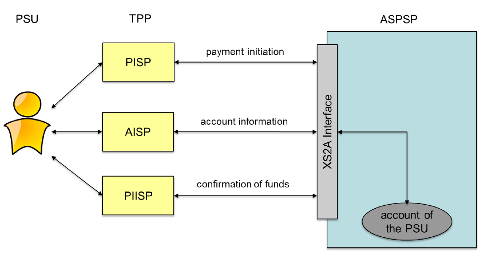

# XS2A Framework
## Services of the XS2A interface
The XS2A interface supports different services. It is distinguished between core services and extended services. According to PSD2 requirements an ASPSP must support all core services at its XS2A interface. The ASPSP is free to decide which extended service it wants to support in its implementation of the XS2A interface in accordance with its own market needs.

## Links to the specifications

Service | Abbr. | Usage |
------- | ---------------- | ----------------
| [Payment initiation service](SER_01.Payment.md) |  PIS  | This service may be used by a PISP to initiate a single payment on behalf of a PSU using a given account of that PSU. The account is managed by the ASPSP providing the XS2A Interface.  |
| Account information service |  AIS  | This service may be used by an AISP to request information about the account of a PSU. The account is managed by the ASPSP providing the XS2A Interface.  |
|  Fund confirmation service |  FCS  | This service may be used by a PIISP to request a confirmation of the availability of specific funds on the account of a PSU. The account is managed by the ASPSP providing the XS2A Interface.  |

